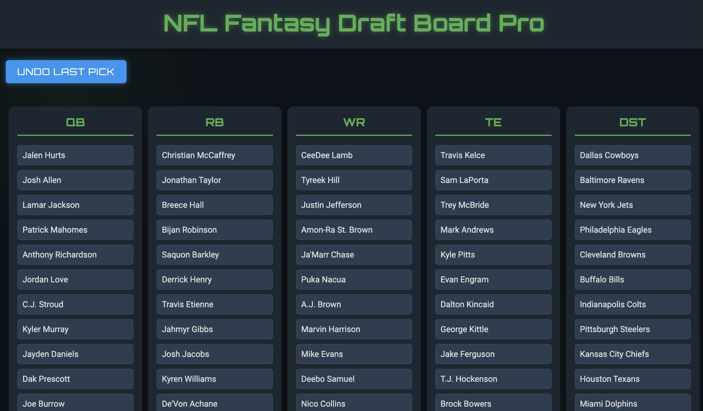

# NFL Fantasy Draft Board

## Description

This application is a web-based tool for managing player selections during fantasy football drafts. It uses Python with Flask for the backend and standard HTML/CSS/JavaScript for the frontend. The interface displays player rankings in a tabular format, allowing for real-time updates as selections are made.

## Features

- Displays player rankings from an Excel file in five columns: QB, RB, WR, TE, and DST
- Allows removal of players from the board via mouse click
- Implements an undo function for accidental removals
- Updates display without page reloads using JavaScript

## Technical Details

1. **Data Management**: 
   - Player data is read from an Excel file using pandas
   - Data is stored in an OrderedDict for maintaining column order

2. **Backend**:
   - Flask routes handle GET and POST requests
   - Player removal and undo operations modify server-side data structures

3. **Frontend**:
   - DOM manipulation is performed with vanilla JavaScript
   - CSS is used for layout and styling, with some transitions for interactivity

## Customization Options

1. **Data Source**: 
   - Modify `read_excel_columns` function in `app.py` to alter data import logic
   - Change Excel file path and sheet name variables as needed

2. **Visual Adjustments**:
   - Edit CSS in `index.html` to alter colors, fonts, and layout
   - Modify HTML structure for different content organization

3. **Functionality Extensions**:
   - Add new routes in Flask for additional backend operations
   - Extend JavaScript functions for more complex frontend interactions

## Usage Instructions

1. **Prerequisites**:
   - Python 3.x
   - Flask, pandas, and openpyxl libraries

2. **Setup**:
   - Clone repository
   - Install dependencies: `pip install flask pandas openpyxl`
   - Prepare Excel file with player rankings

3. **Execution**:
   - Run `python app.py`
   - Access application at `http://localhost:5000` in a web browser

4. **Operation**:
   - Click on player names to remove them from the board
   - Use "Undo Last Pick" button to reverse last removal
   - Board state persists until server restart

## Potential Improvements

- Add user authentication for multi-user support
- Create API endpoints for programmatic access to draft data
- Optimize for high-concurrency scenarios